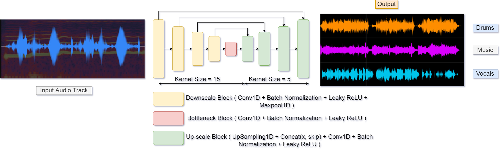
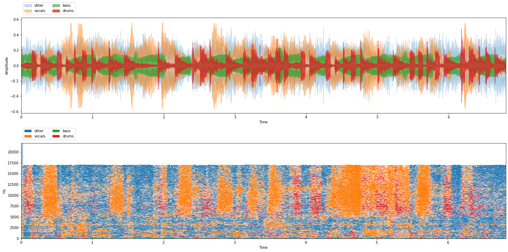
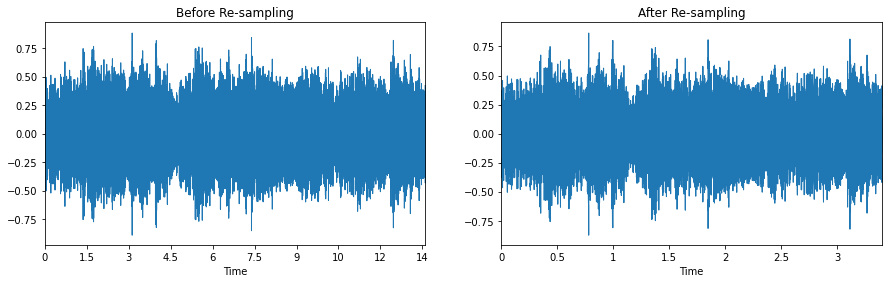
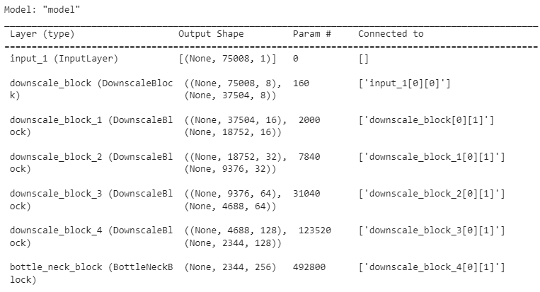
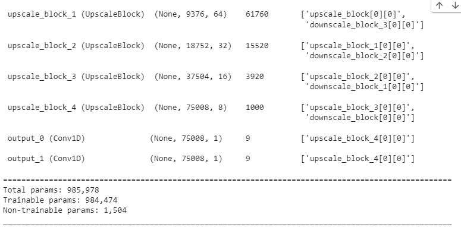
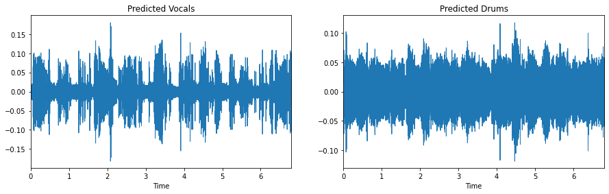
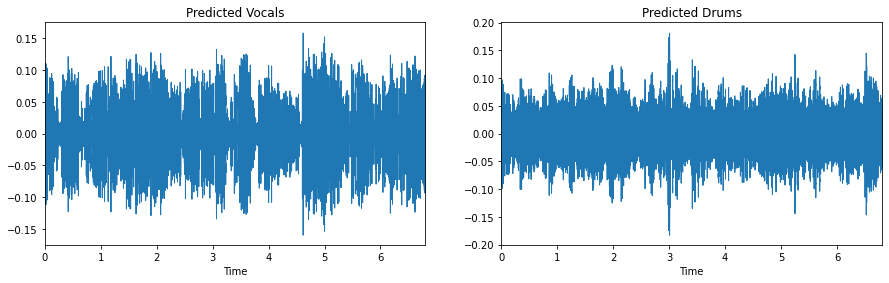
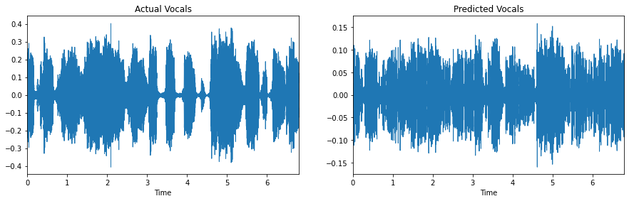
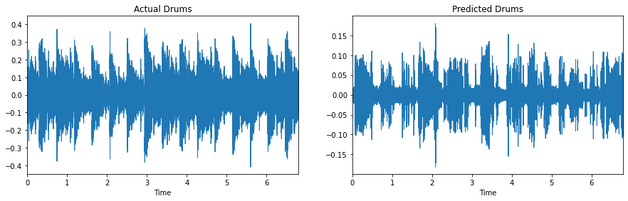

# Audio-Track Separator

<br>

# Introduction

_Audio Source Separation_ is the process of separating a mixture (e.g. a pop band recording) into isolated sounds from individual sources (e.g. just the lead vocals). Basically, splitting a song into separate vocals and instruments.

In this Repository, We developed an audio track separator in tensorflow that successfully separates Vocals and Drums from an input audio song track.

We trained a **U-Net** model with two output layers. One output layer predicts the **Vocals** and the other predicts the **Drums**. The number of Output layers could be increased based on the number of elements one needs to separate from input Audio Track.

# Technologies used:

1. The entire architecture is built with tensorflow. 
2. Matplotlib has been used for visualization. 
3. Numpy has been used for mathematical operations. 
4. Librosa have used for the processing of Audio files.
5. nussl for Dataset.

# The dataset

We will be using the **MUSDB18** dataset for this tutorial. 

The musdb18 is a dataset of 150 full lengths music tracks (~10h duration) of different genres along with their isolated drums, bass, vocals and others stems.

musdb18 contains two folders, a folder with a training set: "train", composed of 100 songs, and a folder with a test set: "test", composed of 50 songs. Supervised approaches should be trained on the training set and tested on both sets.

All signals are stereophonic and encoded at 44.1kHz.

# Exploratory Data Analysis

<br>

<br>

# Building a Data Loader

In the pipeline we are re-sampling the audio data.
For the time being our target is to separate the the Vocal and Drums audio from the original, hence the Pipeline returns original processed Audio as **X** and an array of processed Vocals & Drums audio as **y**.

# Unet Architecture

``` python
model = AudioTrackSeparation()
model.build(input_shape=(None, DIM, 1))
model.build_graph().summary()
```

<br>

# Implementation
## Training
``` python
!python main.py --sampling_rate 11025 --train True --epoch 50 --batch 16 --model_save_path ./models/
```
Trains the u-net model on MUSDB18 Dataset and saves the trained model to the provided directory ( *--model_save_path* ).

## Testing
``` python
!python main.py --sampling_rate 11025 --test /content/pop.00000.wav --model_save_path ./models/
```
Loads the model from *model_save_path*, reads the audio file from the provided path( *--test* ) with librosa, process it and use the model to predict the output. In the end, the predictions are visualized by a wave plot and saved to the root directory.

<br>



# Model Performance


<br>

## Predictions

<br>

<br>

# References

1. <a href='https://arxiv.org/pdf/1806.03185v1.pdf'>Wave-U-Net: A Multi-Scale Neural Network for End-to-End Audio Source Separation</a>

2. <a href='https://arxiv.org/pdf/1706.09588v1.pdf'>Multi-scale Multi-band DenseNets for Audio Source Separation</a>

3. <a href='https://arxiv.org/pdf/1811.11307v1.pdf'>Improved Speech Enhancement with the Wave-U-Net</a>